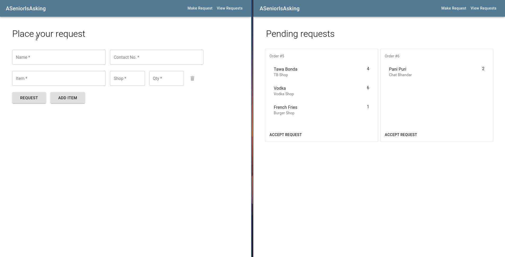

# ASeniorIsAsking
It's past midnight. You're hungry. You're grumpy. You want nothing but food. But... you're lazy too. What would you not do for a Tawa Bonda or a Shawarma? If only you knew which fachcha is already out there at DLF... Inspired from the 3am chats on the UG2k19 WhatsApp Groups, we present to you the only app you'll ever need to fulfill your heart's desire of having that one last meal before your regular 3-hour sleep.
 

### Frontend
The frontend is built using ReactJS, a declarative `JavaScript` library used to build User Interfaces. We are using Material UI as the component library, it is based the Material design language by Google and helps in making the website responsive.

* [Form.js](frontend/src/components/Form.js) : The form component is used to submit and view the order details. A `prop` named `readOnly` decides wether the form is editable. So the same component is used for showing the order details on `/accept-order/:order_id` as well as accepting order on `make-request`
* [Navbar.js](frontend/src/components/Navbar.js) : Contains the source code for navbar. It is a wrapper around `AppBar` provided by Material-UI. The Navbar component has Button components directing the user to the viewports of Pending Requests(/) and Make Request(/make-request).
* [Card.js](frontend/src/components/Card.js) : The Pending Requests page uses the `Card` component to display orders that have already been placed. Clicking on `Accept Request` will take you to the respective page of the order where the person accepting the request is supposed to enter their details.

### Backend
This is a Flask app. It functions on a Redis Server and uses API calls to send and receive data.
* [app.py](backend/src/app.py) : This file starts the app on the server.
* [config.py](backend/src/config.py) : This file contains the information about the redis server.
* [model.py](backend/src/model.py) : This file manages the connection with the `Redis` server, all data to be stored into and fetched from the server goes through this file.
* [views.py](backend/src/views.py) : This file contains the API call routes through which the front end web pages can connect to the Redis database.
   * `/order_request` - This route accepts the order coming from the frontend; verifies that data is valid and stores it in the Redis database and returns the order id generated.
   * `/pending_orders_list` - This route returns a `json` object that contains all the pending orders.
   * `/accepted_orders` - This route returns a `json` object that contains of all the accepted orders.
   * `/accept_order` - This route accepts the data of the person accepting the order and links it with the order that person accepts.
   * `/delete_order/<order_id>` - This route takes in an order_id to be deleted.
   * `/view_order/<order_id>` - This route sends the information about order `<order_id>`.
   * `/edit_order/<order_id>` - This route takes in the order id of that order to be edited and edits.
